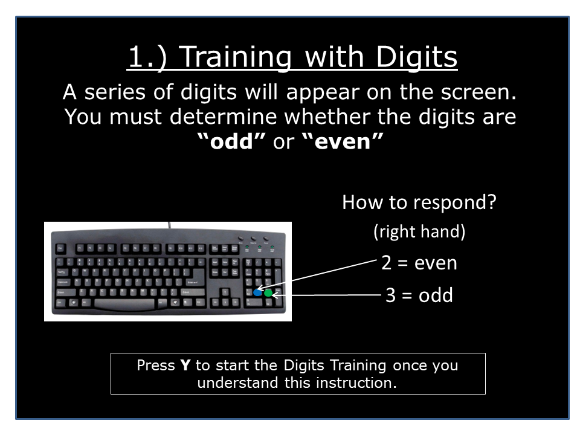
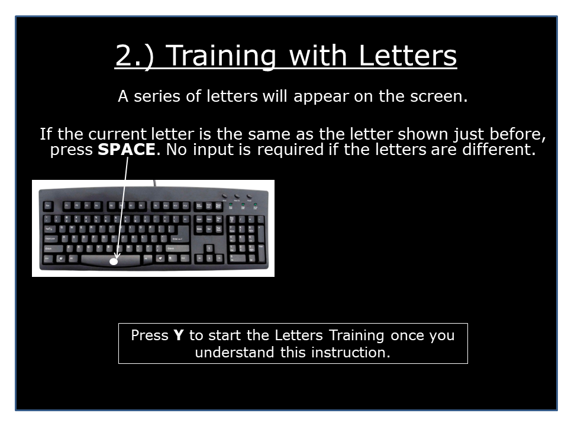
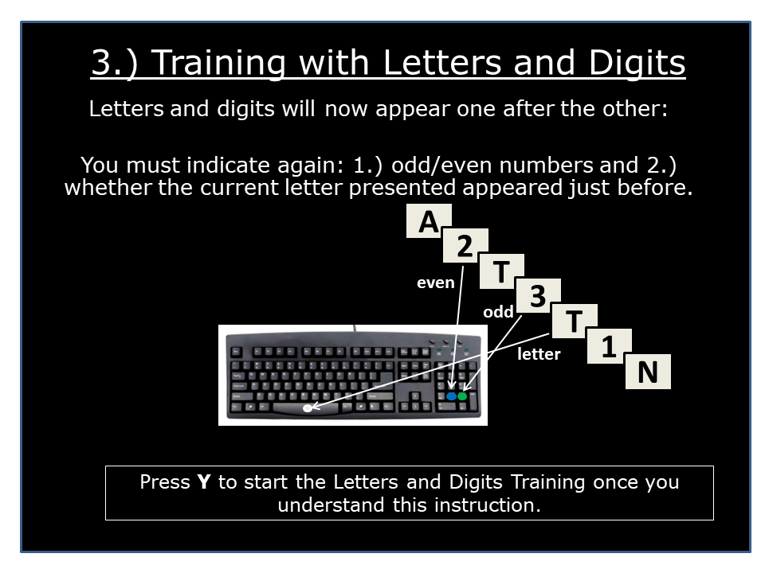

# Test Director Notes

## Introduction
This script is to be used with the TloadDback Pretest, found [here](https://gitlab-ee.aurora.aero/praca103/tloaddback/-/blob/main/pygame_TloadDback_Training_Pretest.py).

The purpose of the pretest is to push the subject to their limit by steadily decreasing the stimulus time duration (STD),
which is the amount of time that the subject has to respond to a character shown on screen.

Specifically, this pretest will determine the HCL (high cognitive load) stimulus time duration,
from which the LCL (low cognitive load) stimulus time duration is also derived [LCL = HCL + 0.5 * HCL].

## Tasks
This pretest has 4 components. For the duration of all these tasks (and the test itself), subjects
**MUST** respond to letter prompts with their **LEFT** hand, and to number prompts with
their **RIGHT** hand. All characters will remain on the screen for the length of the stimulus time duration. 
Subjects must respond during this time (while the character is on screen), or their response to that character will not count:
1. ### Digits Task
   1. Subjects are shown a series of numbers. Subjects must respond using the number pad on the right side of the keyboard. If the number is EVEN, they must press 2. If it is ODD, they must press 3.
   2. This task is NOT scored. It is simply meant for the subject to understand how to respond when shown a number.
   3. This is the instruction shown to the subject: 
2. ### Letter Task
   1. Subjects are shown a series of letters. Subject must respond using the spacebar with their left hand. Subjects CANNOT use their right hand to press the spacebar. If the current letter shown is the same as the letter just shown directly before, subjects must press the spacebar. If the letters are different, no input is required.
   2. This task is NOT scored. It is simply meant for the subject to understand how to respond when shown a letter.
   3. This is the instruction shown to the subject: 
3. ### The 'Learning Loop'
   1. This is the subject's first exposure to how the test is actually conducted. During this task, subjects will be shown an alternating sequence of letters and numbers. Sequences will ALWAYS be letter--> number --> letter --> number, with 30 letters and 30 numbers (60 characters in total per loop).
   2. When the character is a number, the subject must indicate if the number is even or odd using the same technique as the Digits Task (even --> press 2, odd --> press 3 [always using the number pad on the right of the keyboard with their right hand.])
   3. When the character is a letter, the subject must determine if this was the letter most recently shown to them (aka the character shown right before the letter they had just seen.) If it is, they must press the spacebar with their left hand. 
   4. An example would be the sequence `A - 7 - A - 8 - L`, in which the correct input would be `<no input> - 3 (because it's odd) - SPACEBAR - 2 (because it's even) - <no input>`
   5. The subject will be stuck in this loop until they achieve performance > 0.85. **The stimulus time duration is 1.5 seconds.**
   6. This is the instruction shown to the subject: 
4. ### The Real Pretest
   1. The actual pretest follows the exact same structure as the learning loop, in which the subject is shown an alternating letter and number sequence, for 60 characters in total.
   2. The subject can and should take a break before starting. Once they are ready, they can press 'Y' to continue.
   3. For this test, the stimulus time duration is 1.4 seconds initially. As the subject continues to do well, the STD will decrease by 0.1 seconds each loop.
   4. An "error" counts as a loop (aka 60 character sequence) in which the subject's performance was < 0.85. If the subject makes 3 consecutive errors under the same STD, the HCL will be 0.1 seconds less than that STD. If the subject makes 3 accumulative errors (across differing STD values), then HCL is equal to the STD they most recently completed.
   5. Subjects are not shown an instruction image for this component. Subjects should be able to understand that the pretest is the same as the learning loop without direction.

Overall, the instruction images should provide comprehensive information to the subject. 

## Hotkeys

During this test, there is a total of 5 keys that act as valid input:

- `ESC`: This will kill the script, and should only be pressed if the subject cannot continue the test or chooses to quit. It may require pressing a few times before the script is killed. If pressed, no data is saved.
- `y`: This is the key the subject presses to continue to the next instruction once they understand it, or to start a loop after a break. Once an instruction is cleared from the screen, the subject cannot view the instruction again. Subjects should also be encouraged to take as long as a break that they need between loops and tasks.
- `spacebar`: The subject presses the spacebar if the letter on the screen is the same as the letter most recently shown to them. **They must use their left hand to press the spacebar.**
- `2`: If a number is **even**, the subject presses `2` with their **right hand** using the number pad on the right of the keyboard.
- `3`: If a number is **odd**, the subject presses `3` with their **right hand** using the number pad on the right of the keyboard.
- ### **_NOTE: Do not click the mousepad!_**

## Test Director Script

#### The HCL and LCL values will be saved under `results/Results_TloadDback_PRETEST/PRETEST_<subject number>.csv`
#### The subject's letter and digits task and actual pretest performance is saved under `results/Results_TloadDback_TRAINING/TRAINING_<subject number>.csv`

### Starting the test
_**Mappings of subject name to their subject numbers should be created before any testing occurs.**_

_Before the subject is present, configure the test_settings.yaml file. You should have the subject's information beforehand. 
If you do not have this information beforehand, or would like to verify the information in the config, you may ask the subject for their name, age, and sex. They should not know their subject identifier. 
The subject number is an identifier and must be unique. Subject number should contain only letters and numbers._

- Set the necessary configs in `configs/test_settings.yaml`
  - Subject number (Must be unique. Must contain only letters and numbers.)
  - Age (May be left a dummy value. Must be a positive integer)
  - Sex (Must be either "male" or "female")
  - Condition (Must be either "HCL" or "LCL". The pretest will calculate both, but this value determines how the test is run.)
  - Test_Reps (Not required. If not set, test runs for 16 minutes. If set, the test will run the specified number of times. Must be a positive integer if uncommented.)
- navigate to the `tloaddback` folder on the command line if not done already.

**"Welcome to the cognitive pretest. During this test, you will have to respond to characters on the 
screen using the keyboard. The characters will only be on the screen for a short, predetermined period of time. 
During the time that the character is on the screen, you must provide the correct input to the best of your ability. 
If you respond after the character has left the screen, your response will not be counted. Therefore, you must respond _AS QUICKLY AS POSSIBLE._"**

**"These characters will either be a letter or a number. The directions for how to respond to the characters will be provided to you as you progress through the tasks. However, I CAN inform you that you will either have to press the SPACEBAR or will have to use the number pad on the RIGHT of the keyboard when providing input during the tasks. You CANNOT use the number pad at the TOP of the keyboard. During the tasks, anytime you are required to press the SPACEBAR, you MUST do so with your LEFT hand. When you are required to use the number pad, you MUST do so with your RIGHT hand. For any other key input that is asked of you, you may use either hand. During this test, you do NOT need to provide mouse input. It is critical that you do not click the mouse or move the mouse. If you wish for the mouse or cursor to be moved, ask me to move it BEFORE a task starts."**

**"At predetermined times during the pretest, you will have time to take a break. During this time, you are allowed to rest for as long as you need to. It is highly encouraged that you take breaks when offered."**

**"You may quit this pretest at any time. If you choose to quit, your responses and data will not be recorded, and the pretest will be rendered invalid. If you quit during the pretest, you will NOT be able to progress to the actual test. To quit, ask me to end the pretest."**

**"We will soon start. The first 3 tasks are meant to help you understand what will be required of you before the actual pretest starts. When you reach the actual pretest, you will be required to wait for me to provide further instruction. The tasks will now start."**

- Prepare to run the script. Make sure the mouse cursor is in a corner before starting to prevent distraction. Make sure 'Y' is not pressed when presenting the screen and keyboard to the subject.
- run `python pygame_TloadDback_Training_Pretest.py`  [it's okay if it takes awhile. Just run this code, and present the screen and keyboard to the subject. The tasks will not start until the subject views the instructions.]

### At the start of the pretest

_There will be a pause before the actual pretest starts. Provide the following information before proceeding:_

**"You have now reached the actual pretest. This test is the exact same task as the letter and digits exercise you just completed. However, if you continue to maintain a high level of performance for each set of character sequences, the time that the characters appear on screen will gradually decrease. This means that you will have to respond to a character within a shorter timeframe. After completing a full character sequence, you will have the option to take a break. Just as before, it is encouraged that you take as long as you need to rest before starting another character sequence set. The pretest ends once too many mistakes have been made. To make sure this pretest is accurate, you must remain focused and respond as quickly as you can. If you understand this and are ready to begin, follow the instructions on screen. If you need to rest for longer, you may do so before starting.""**

### At the end of the pretest

**"Thank you for participating in the pretest. You will complete the actual test at another time. You may now take a break and ask any questions that you may have.""**
