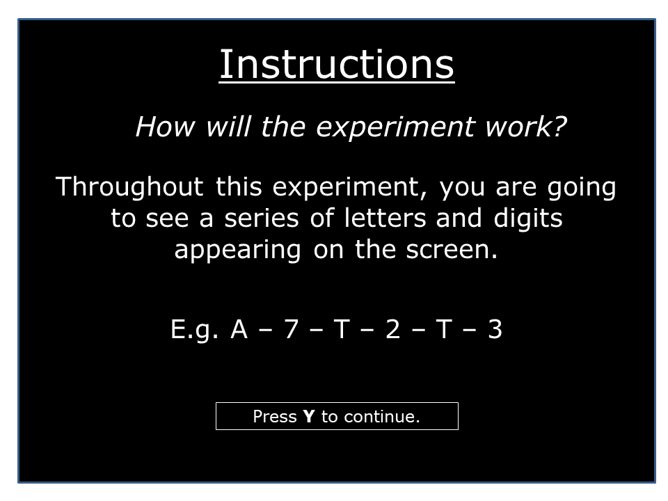
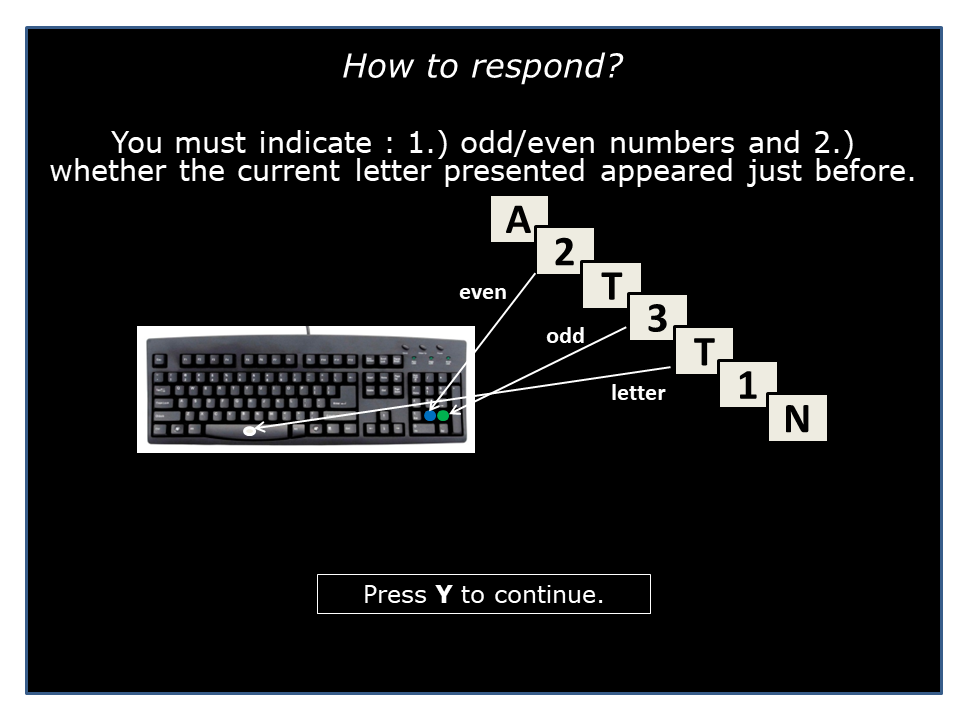
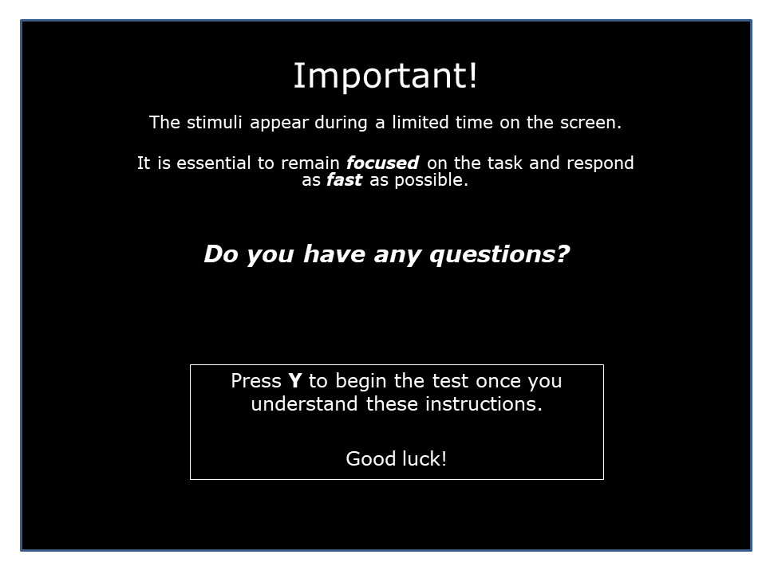

# Test Director Notes

## Introduction
This script is to be used with the TloadDback Test, found [here](https://gitlab-ee.aurora.aero/praca103/tloaddback/-/blob/main/pygame_TloadDback.py).

The purpose of the test is to measure performance under either high cognitive load (HCL) or low cognitive load (LCL). 
The HCL and LCL stimulus time durations were calculated from the pretest. You cannot conduct this test on a subject who has not completed the pretest.

## Tasks

The test only has one task, which is the same as the letters and digits task (and the pretest) from before:
1. When the character is a number, the subject must indicate if the number is even or odd using the same technique as the Digits Task (even --> press 2, odd --> press 3 [always using the number pad on the right of the keyboard with their right hand.])
2. When the character is a letter, the subject must determine if this was the letter most recently shown to them (aka the character shown right before the letter they had just seen.) If it is, they must press the spacebar with their left hand. 
3. An example would be the sequence `A - 7 - A - 8 - L`, in which the correct input would be `<no input> - 3 (because it's odd) - SPACEBAR - 2 (because it's even) - <no input>`

60 characters in total will be shown (30 letters and 30 numbers), which will alternate in the same order of the pretest (letter --> number --> letter)

The number of sequence sets shown is either determined by a config parameter, or by the predetermined value set forth
in Borragan et al. (2017). If `test_reps` is set in the config file (this must be a positive integer), then the 
subject will be shown `N=test_reps` number of 60 character sequence sets. If this value remains commented out,
the subject will have to do the test for 16 minutes. It is recommended to follow the 16 minute guide outlined
by Borragan et al. (2017).

The subject is shown the following images, which reiterates the directions from the letter and digits task/pretest that they have already mastered.

## Hotkeys

During this test, there is a total of 5 keys that act as valid input:

- `ESC`: This will kill the script, and should only be pressed if the subject cannot continue the test or chooses to quit. It may require pressing a few times before the script is killed. If pressed, no data is saved.
- `y`: This is the key the subject presses to continue to the next instruction once they understand it, or to start a loop after a break. Once an instruction is cleared from the screen, the subject cannot view the instruction again. Subjects should also be encouraged to take as long as a break that they need between loops and tasks.
- `spacebar`: The subject presses the spacebar if the letter on the screen is the same as the letter most recently shown to them. **They must use their left hand to press the spacebar.**
- `2`: If a number is **even**, the subject presses `2` with their **right hand** using the number pad on the right of the keyboard.
- `3`: If a number is **odd**, the subject presses `3` with their **right hand** using the number pad on the right of the keyboard.
- ### **_NOTE: Do not click the mousepad!_**

## Test Director Script

#### The subject's test performance is saved under `results/Results_TloadDback_<performance metric>/<performance metric>_<subject number>_<condition>.csv`

### Starting the test
The test script pulls from `configs/test_settings.yaml`, just as it did for the pretest. You MUST guarantee that 
the subject information (subject number, age, and sex) are correct for the subject being tested. The subject number for the subject
MUST be the same for the pretest and test.

If the config was not modified in between the pretest and test for the subject, you only need to change the `condition`
parameter. This may either be set to "LCL" (low cognitive load) or "HCL" (high cognitive load) depending on the condition
you wish to test. 

Furthermore, although it is NOT recommended, you may set how many sequences the subject will see during the test.
In Borragan et al. (2017), the test is ran for 16 minutes (num_sequences_shown = round(16/stimulus_time_duration)).
If you uncomment `test_reps` in `configs/test_settings.yaml`, you may set this to any positive integer that you wish.
It is not recommended to test for longer than the maximum of 16 minutes, but you may allow the test to run for 
a shorter period of time. 

- navigate to the `tloaddback` folder on the command line if not done already.

**"Welcome to the test. This test requires you to do the same task as the actual pretest, in which you must respond to an alternating sequence of letters and numbers as quickly as you can. No breaks will be given during the test."**

**"As previously instructed, you will either have to press the SPACEBAR or will have to use the number pad on the RIGHT of the keyboard when providing input during the tasks. You CANNOT use the number pad at the TOP of the keyboard. During the tasks, anytime you are required to press the SPACEBAR, you MUST do so with your LEFT hand. When you are required to use the number pad, you MUST do so with your RIGHT hand. For any other key input that is asked of you, you may use either hand. During this test, you do NOT need to provide mouse input. It is critical that you do not click the mouse or move the mouse. If you wish for the mouse or cursor to be moved, ask me to move it BEFORE the test starts."**

**"You may quit this test at any time. If you choose to quit, your responses and data will not be recorded, and the test will be rendered invalid. To quit, ask me to end the test."**

**"We will soon start. You will first be shown 3 instructions once more, which reiterate the same procedure as the actual pretest. Once you understand the instructions, the test will immediately begin."**

- Prepare to run the script. Make sure the mouse cursor is in a corner before starting to prevent distraction. Make sure 'Y' is not pressed when presenting the screen and keyboard to the subject.
- run `python pygame_TloadDback.py`  [it's okay if it takes awhile. Just run this code, and present the screen and keyboard to the subject. The tasks will not start until the subject views the instructions.]

### At the end of the test

**"Thank you for participating in the test. You may now take a break and ask any questions you may have. You may be asked to complete the test again at another time."**

